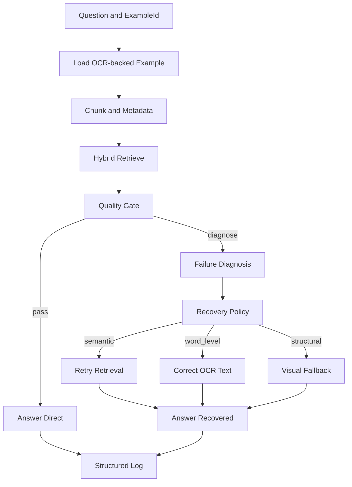

# Architecture

## System Summary

FAAR improves OCR-heavy document QA by combining text-first retrieval with failure-aware recovery. The controller first evaluates answerability with a quality gate, then applies typed recovery only when needed:

- `semantic` -> retrieval retry/backtracking
- `word_level` -> OCR text correction
- `structural` -> selective visual fallback

This design keeps the default path lightweight while preserving robust handling of difficult OCR cases.

## High-Level Flow

## Main Components

- Ingestion/chunking: prepares OCR text and metadata for retrieval.
- Retriever: text-first hybrid retrieval over indexed chunks.
- Quality gate: decides direct answer vs recovery path.
- Failure diagnosis + policy: maps failures to recovery actions.
- Recovery modules: targeted correction, retry, or visual fallback.
- Logging: structured outputs for reproducibility and analysis.
