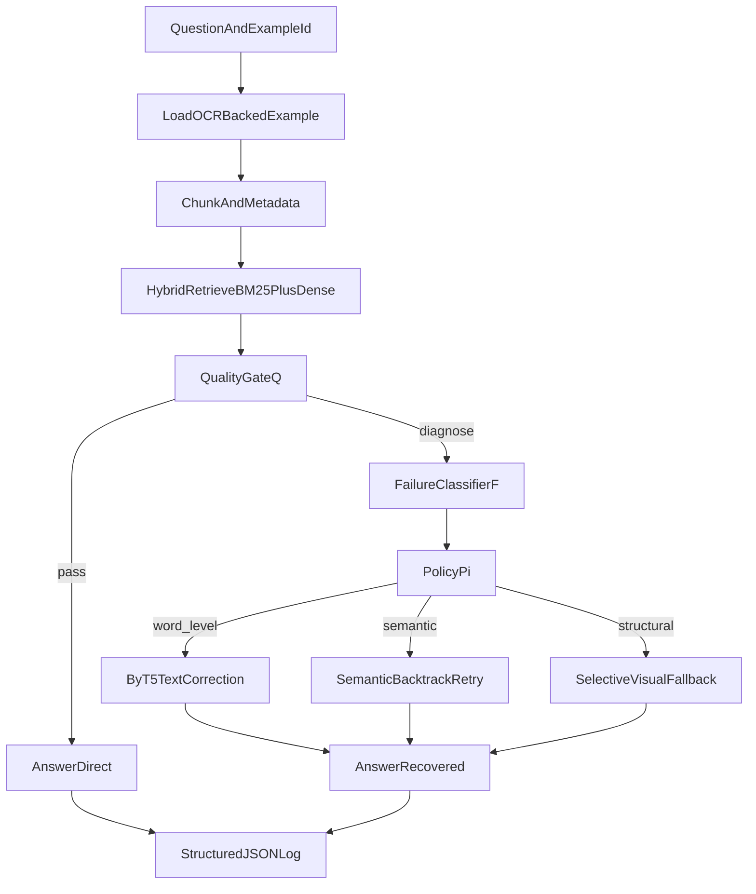

# failure-aware-ocr-rag

Failure-Aware Agentic Recovery (FAAR) for OCR-RAG document question answering.

## Abstract

This repository investigates failure-aware control for OCR-induced errors in retrieval-augmented document QA. FAAR introduces a quality-gated, typed recovery controller that routes each query through diagnosis classes (`semantic`, `word_level`, `structural`) and action-specific recovery (`retry_retrieval`, `correct_text`, `invoke_vlm`). The objective is to improve answer quality on OCR-heavy inputs while reducing unnecessary multimodal cost.

## Method Overview

FAAR uses text-first retrieval and only invokes recovery modules when quality and diagnosis signals indicate likely failure.



## Research Objective

- Hypothesis: typed, failure-aware recovery outperforms naive OCR-RAG handling under OCR corruption while using fewer expensive visual calls than always-on multimodal pipelines.
- Current scope: Phases 1-3 are completed for prototype, formalization, and initial benchmark/ablation reporting.

## Reproducible Quick Start

### Prerequisites

- Python 3.12+
- phase assets under `data/phase0/` and `artifacts/phase0/`

### Install

```bash
python -m pip install -e .
```

### Run one end-to-end example

```bash
faar-demo run-example --example-id 446d159e-b5c2-45dc-91cc-faaa931f3649 --project-root . --vlm-backend mock --seed 42 --output logs/phase1/phase1_e2e_latest.json
```

### Run test suite

```bash
python -m pytest
```

## Repository Structure

- `src/faar/`: controller, quality, retrieval, recovery, answering, CLI
- `tests/`: unit and integration coverage
- `data/phase0/`: sampled benchmark metadata and manual labels
- `artifacts/`: phase artifacts and summary files
- `logs/`: per-run structured outputs by phase
- `docs/`: modular phase and repository documentation
- `OHR-Bench/`: benchmark/evaluation subproject

## Documentation

- Docs home: [docs/index.md](./docs/index.md)
- Phase docs: [docs/phases/index.md](./docs/phases/index.md)
- Repo handbook: [docs/repo_handbook/index.md](./docs/repo_handbook/index.md)
- Reports: [docs/reports/index.md](./docs/reports/index.md)
- Archives: [docs/archives/index.md](./docs/archives/index.md)

### Suggested reading order

1. [docs/phases/phase_overview/faar_execution_plan.md](./docs/phases/phase_overview/faar_execution_plan.md)
2. [docs/repo_handbook/runtime_components.md](./docs/repo_handbook/runtime_components.md)
3. [docs/phases/phase1/completion_report.md](./docs/phases/phase1/completion_report.md)
4. [docs/phases/phase2/methodology_formalization.md](./docs/phases/phase2/methodology_formalization.md)
5. [docs/repo_handbook/data_and_artifacts_map.md](./docs/repo_handbook/data_and_artifacts_map.md)

## Project Status

- Phase 0: complete (grounding sample and manual labels)
- Phase 1: complete (prototype pipeline validated)
- Phase 2: complete (formalization and documentation modularization)
- Phase 3: complete (benchmark runner, ablations, metrics artifacts, and reporting)
- Next milestone: Phase 4 claim refinement and Phase 5 paper drafting

## Operational Notes

- `vlm-backend=mock` is the default for offline reproducibility.
- API-backed visual evaluation is primarily required in Phase 3 benchmarking and cost analysis.
