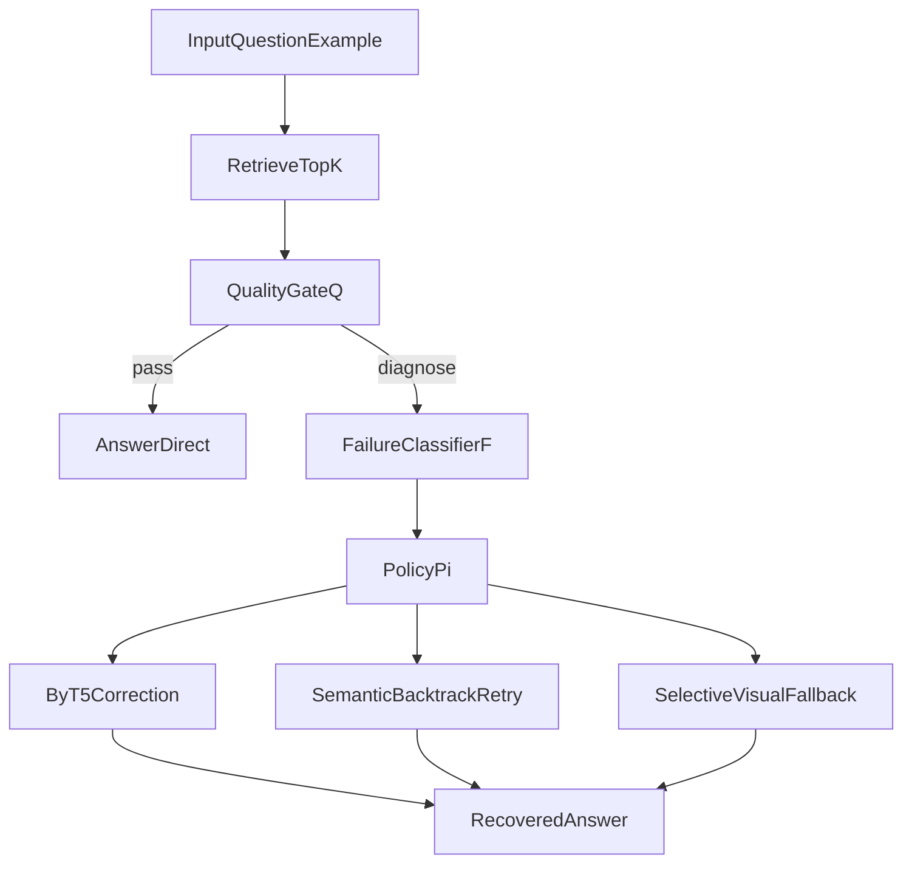

# Phase 2 Methodology Formalization

## Purpose

This document formalizes the implemented FAAR controller in mathematical terms for methodology writing and experimental traceability.

## Scope

In scope:

- quality-gate decision formalization
- typed failure diagnosis formalization
- policy-action routing formalization
- utility and cost trade-off formalization
- one concrete execution trace aligned with runtime logs

Out of scope:

- new model training
- new benchmark runs
- baseline reproduction

## Symbols and Objects

Let:

- `q` be the user question
- `H = [h1, ..., hk]` be retrieved hits sorted by fused retrieval score
- `c = h1.chunk.text` be top-hit text used by the gate
- `d = h1.dense_score`
- `l = h1.bm25_score`
- `w(c)` be OCR corruption score from `weird_char_ratio(c)`
- `s(c)` be layout signal count from `layout_signals(c)`

Thresholds are runtime settings:

- `tau_q`: `quality_threshold`
- `tau_s`: `structural_threshold`
- `tau_w`: `weird_char_threshold`
- `tau_l`: `lexical_floor`
- `tau_d`: `dense_floor`

## Controller Overview

## Quality Gate `Q(c)`

`score = 0.40*d + 0.35*l + 0.25*(1 - min(w(c), 1))`

Reason set `R` includes:

- `low_quality_score` if `score < tau_q`
- `layout_alert` if `s(c) >= tau_s`
- `word_noise_alert` if `w(c) > tau_w`
- `low_lexical_score` if `l < tau_l`
- `low_dense_score` if `d < tau_d`

Decision:

- `Q(c) = pass` iff `R` is empty
- otherwise `Q(c) = diagnose`

## Failure Classifier `F(c)`

For gate failures:

- `structural` if `s(c) >= tau_s`
- else `word_level` if `w(c) > tau_w`
- else `semantic`

If no hits exist, `F(c) = semantic`.

## Policy `pi(s)`

Deterministic policy:

- if `Q(c) = pass` then `answer_direct`
- if `F(c) = word_level` then `correct_text`
- if `F(c) = structural` then `invoke_vlm`
- if `F(c) = semantic` then `retry_retrieval`

## Utility `U(a)`

`U(a) = E[Accuracy(a)] - lambda * Cost(a)`

Phase 2 note: utility is defined for evaluation framing and Phase 3 analysis; current system logs needed decision data for downstream estimation.

## Implementation Alignment

This formalization matches:

- `src/faar/quality.py`
- `src/faar/graph.py`
- `src/faar/recovery.py`
- `src/faar/cli.py`
