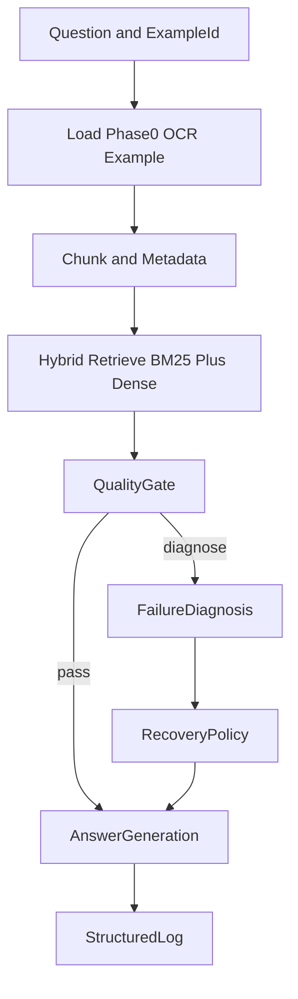

# System Overview (Explanation)

## What We Are Building

FAAR is a failure-aware OCR-RAG pipeline for document QA.  
It detects likely OCR-induced retrieval/answering failures and routes each case to a typed recovery policy instead of using one fixed fallback strategy.

## Project Goal

Improve answer quality on OCR-heavy documents while controlling multimodal cost:

- use lightweight text-first retrieval and answering when quality is high
- apply targeted recovery only when quality diagnostics indicate likely failures

## High-Level Architecture

## Why This Shape

- The quality gate separates easy from risky cases early.
- The failure taxonomy enables different actions for different error modes.
- Structured logging allows research-grade analysis of controller decisions.

## Main Data Assets

- `data/phase0/`: sampled benchmark metadata and manual labels
- `artifacts/phase0/`: OCR text and extracted assets
- `logs/phase1/`: per-example run outputs
- `artifacts/phase1/`: run summaries and analysis artifacts

