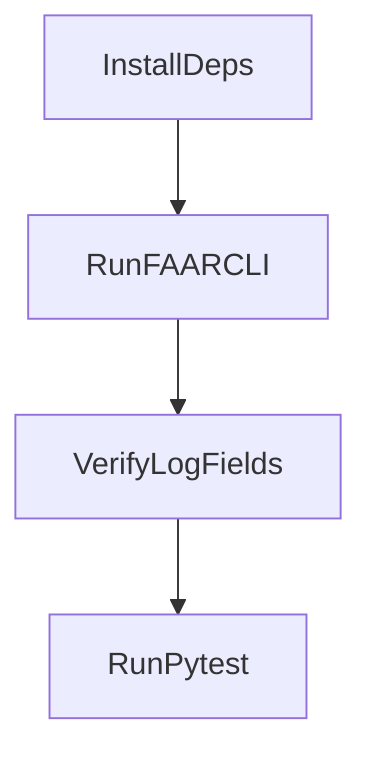

# How-To: Run Phase 1 End-to-End

## Goal

Execute one complete Phase 1 run and produce a structured log in `logs/phase1/`.

## Prerequisites

- Python 3.12+ available
- Repository dependencies installed
- Phase 0 assets present under `data/phase0/` and `artifacts/phase0/`

## Steps

1. Install project dependencies:

```bash
python -m pip install -e .
```

1. Run one example:

```bash
faar-demo run-example --example-id 446d159e-b5c2-45dc-91cc-faaa931f3649 --project-root . --vlm-backend mock --seed 42 --output logs/phase1/phase1_e2e_latest.json
```

1. Validate output JSON contains:

- `gate`
- `failure_type`
- `policy_action`
- `action_outcome`
- `run_metadata`

1. Run tests:

```bash
python -m pytest
```

## Quick Flow




