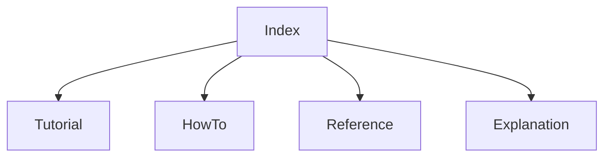

# Repository Architecture Docs

This folder documents the FAAR repository using a Diataxis-oriented layout:

- Tutorial: learn by doing
- How-to: complete specific tasks
- Reference: exact components and interfaces
- Explanation: design rationale and architecture

## Navigation

- [System Overview (Explanation)](./explanation_system_overview.md)
- [Component Reference (Reference)](./reference_components.md)
- [Run Phase 1 (How-to)](./howto_run_phase1.md)
- [First Run Tutorial (Tutorial)](./tutorial_first_run.md)

## Documentation Map

