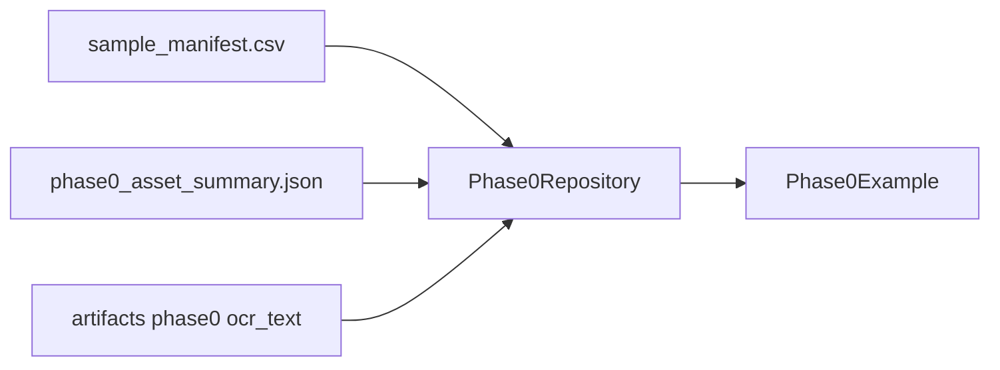
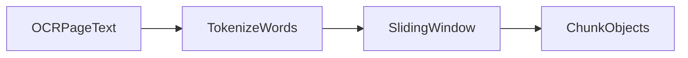
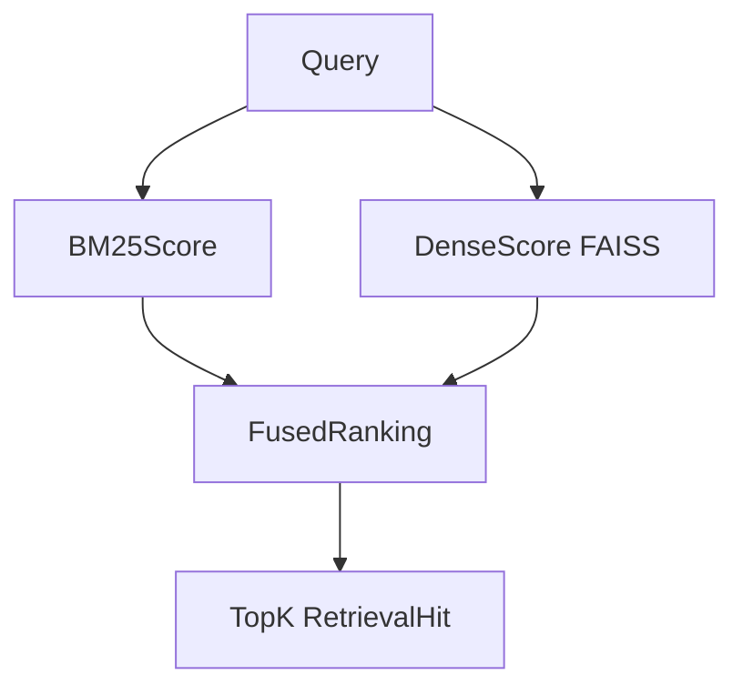
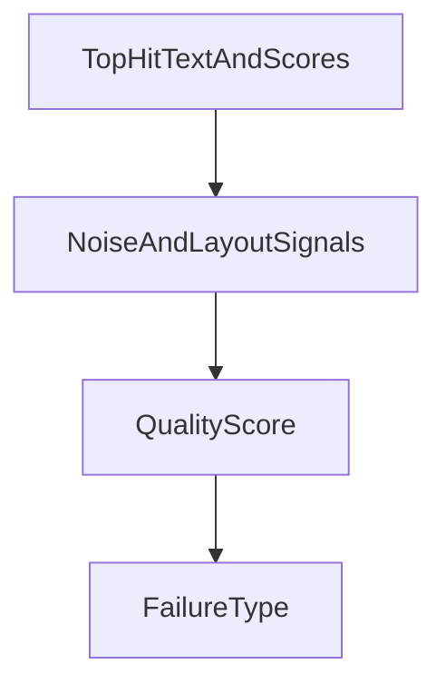
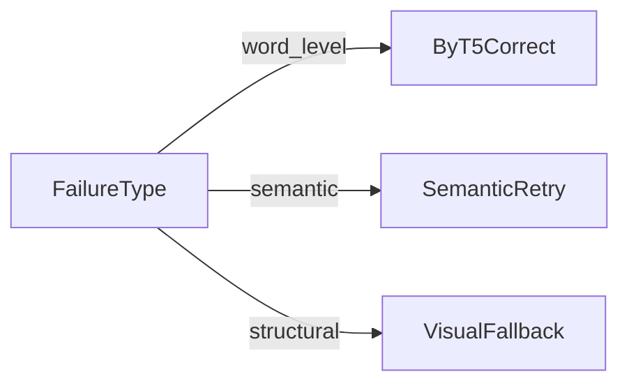
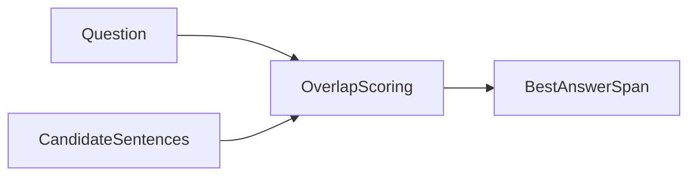
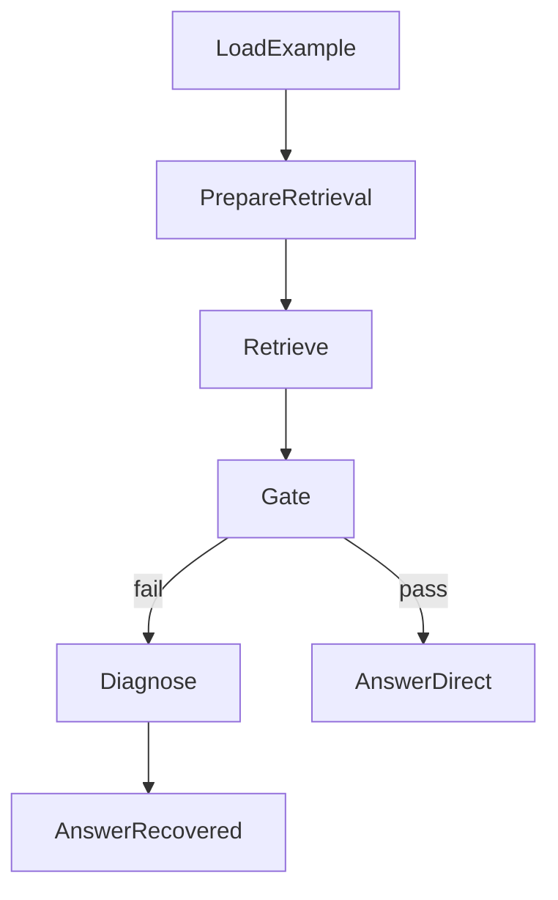
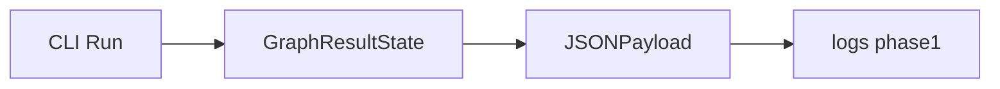

# Component Reference

## Ingestion and Data Access

- Source module: `src/faar/data.py`
- Primary responsibility: load Phase 0 manifest/summary and return `Phase0Example`.

## Chunking

- Source module: `src/faar/chunking.py`
- Splits OCR page text into overlapping chunks with IDs and page metadata.

## Retrieval and Embedding

- Source module: `src/faar/retrieval.py`
- Hybrid retriever combining BM25, dense retrieval, and fused scoring.

## Quality Gate and Diagnostics

- Source module: `src/faar/quality.py`
- Computes quality score and routes to failure taxonomy.

## Recovery

- Source module: `src/faar/recovery.py`
- Implements typed recovery actions:
  - `word_level`: ByT5 correction
  - `semantic`: query backtrack/retry
  - `structural`: selective visual fallback

## Answering

- Source module: `src/faar/answering.py`
- Uses extractive overlap heuristic over retrieved/recovered context.

## Controller and Orchestration

- Source module: `src/faar/graph.py`
- LangGraph state machine connecting all modules with conditional routing.

## Logging and CLI

- Source module: `src/faar/cli.py`
- Produces per-run JSON output with:
  - controller path
  - action outcome status
  - run metadata for reproducibility

