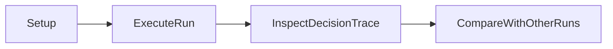

# Tutorial: First Contributor Run

## Objective

Understand the FAAR Phase 1 pipeline by running one example and inspecting the resulting decision trace.

## Step 1: Prepare environment

```bash
python -m pip install -e .
```

## Step 2: Execute a run

```bash
faar-demo run-example --example-id 446d159e-b5c2-45dc-91cc-faaa931f3649 --project-root . --vlm-backend mock --seed 42 --output logs/phase1/tutorial_run.json
```

## Step 3: Inspect outputs

Open `logs/phase1/tutorial_run.json` and review:

- `gate.reasons`
- `failure_type`
- `policy_action`
- `action_outcome`
- `top_hits`

## Step 4: Compare against baseline examples

Use previous logs in `logs/phase1/` to compare different policy routes.

## Learning Flow




