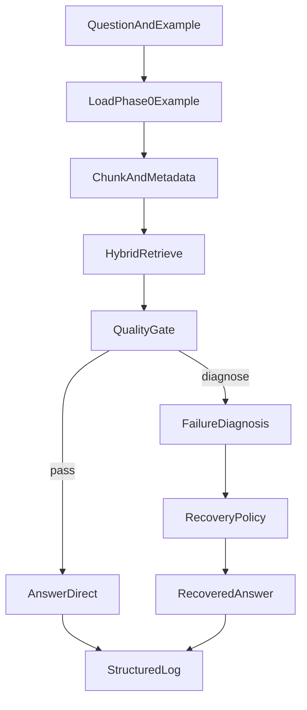

# Architecture Overview

## System Goal

Improve OCR-heavy document QA quality while controlling multimodal cost through selective, typed recovery.

## High-Level Pipeline

## Why This Design

- quality gate separates easy from risky cases early
- typed diagnosis supports action specialization
- structured logs enable per-example analysis and reproducibility

