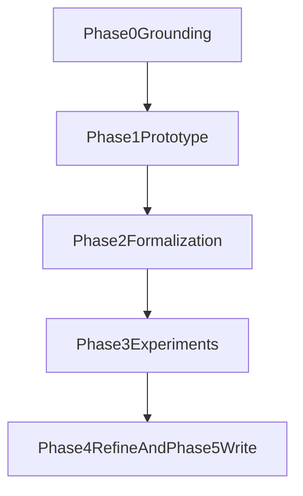

# Repository Overview

## Purpose

`failure-aware-ocr-rag` implements FAAR: a failure-aware OCR-RAG controller for document QA that applies typed recovery only when quality diagnostics indicate risk.

## Repository Areas

- `src/faar/`: core controller, quality, retrieval, recovery, answering, and CLI
- `tests/`: automated tests for routing, quality logic, settings, and payloads
- `data/phase0/`: sampled benchmark metadata and manual labels
- `artifacts/phase0/`, `artifacts/phase1/`: OCR and phase outputs
- `logs/phase1/`: per-example runtime logs
- `docs/`: modular docs (phases, handbook, reports, archives)
- `OHR-Bench/`: benchmark/evaluation subproject

## Development Lifecycle

